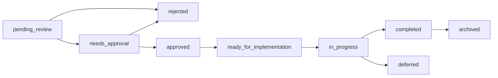

# Feedback System Feature Module

## 📁 Architecture Overview

This feature module implements a clean, maintainable feedback/suggestion system following domain-driven design principles.

```
src/features/feedback/
├── README.md                  # This documentation
├── api/
│   └── routes/
│       ├── suggestions.ts     # Main suggestion endpoint handler
│       └── admin.ts          # Admin management endpoint handler
├── components/
│   ├── index.ts              # Component exports
│   ├── SuggestionButton.tsx  # Main feedback button component
│   ├── FeedbackScopeSelector.tsx
│   ├── QuickSuggestions.tsx
│   └── SuggestionTextarea.tsx
├── contexts/
│   └── FeedbackContext.tsx   # React context for feedback state
├── hooks/
│   ├── index.ts              # Hook exports
│   ├── useSuggestionForm.ts  # Form state management
│   └── useElementSelection.ts # Element selection logic
├── lib/
│   ├── feedbackService.ts    # Core business logic and data management
│   └── smartSuggestions.ts   # Smart suggestion generation
├── types/
│   ├── index.ts              # Main type exports
│   └── components.ts         # Component-specific types
└── utils.ts                  # Utility functions
```

## 🎯 Key Features

### 1. **Multi-Scope Feedback**
- **Site-wide**: General website feedback
- **Page-specific**: Current page improvements  
- **Element-specific**: Target specific UI elements

### 2. **Smart Suggestions**
- Context-aware quick suggestions
- User interaction learning
- Time-based recommendations

### 3. **Admin Management**
- Comprehensive admin dashboard
- AI-powered instruction generation
- Status workflow management

### 4. **Type Safety**
- Full TypeScript coverage
- Strongly typed API contracts
- Component prop validation

## 🔧 Usage Examples

### Basic Integration

```typescript
// App layout integration
import { SuggestionButton } from '@/features/feedback/components'

export default function Layout({ children }) {
  return (
    <div>
      {children}
      <SuggestionButton />
    </div>
  )
}
```

### Using the Feedback Context

```typescript
import { useSuggestionContext } from '@/features/feedback/contexts/FeedbackContext'

function MyComponent() {
  const { currentPage, isVisible, updatePage } = useSuggestionContext()
  
  useEffect(() => {
    updatePage(window.location.pathname)
  }, [])
  
  return <div>Current page: {currentPage}</div>
}
```

### Custom Feedback Form

```typescript
import { useSuggestionForm } from '@/features/feedback/hooks'
import { FeedbackScope } from '@/features/feedback/types'

function CustomFeedbackForm() {
  const {
    formData,
    updateFormData,
    submitSuggestion,
    isSubmitting,
    errors
  } = useSuggestionForm({
    onSuccess: () => console.log('Feedback submitted!'),
    onError: (error) => console.error(error)
  })

  return (
    <form onSubmit={(e) => {
      e.preventDefault()
      submitSuggestion('page')
    }}>
      <textarea
        value={formData.suggestion}
        onChange={(e) => updateFormData({ suggestion: e.target.value })}
        placeholder="Your feedback..."
      />
      <button type="submit" disabled={isSubmitting}>
        Submit Feedback
      </button>
    </form>
  )
}
```

## 📡 API Endpoints

### POST /api/suggestions
Submit new feedback/suggestion

**Request:**
```typescript
{
  suggestion: string
  contact?: string
  page: string
  url: string
  feedbackScope: 'site' | 'page' | 'element'
  selectedElements?: SelectedElement[]
}
```

**Response:**
```typescript
{
  success: boolean
  message: string
  id?: string
}
```

### GET/POST /api/admin/suggestions
Admin management endpoints

**Features:**
- List all suggestions with filters
- Update suggestion status
- Generate AI instructions
- Get analytics/stats

## 🔄 Workflow States



## 🧪 Testing

### Component Testing
```bash
# Run component tests
npm run test src/features/feedback/components

# Run with coverage
npm run test:coverage src/features/feedback
```

### API Testing
```bash
# Test suggestion submission
curl -X POST http://localhost:3000/api/suggestions \
  -H "Content-Type: application/json" \
  -d '{"suggestion":"Test feedback","page":"/","url":"http://localhost:3000"}'

# Test admin endpoints
curl -X GET http://localhost:3000/api/admin/suggestions \
  -H "Authorization: Bearer YOUR_ADMIN_TOKEN"
```

## 🚀 Performance Optimizations

### 1. **Lazy Loading**
- Components are dynamically imported
- Reduces initial bundle size
- Improves page load performance

### 2. **Smart Caching**
- Context state persistence
- API response caching
- User interaction history

### 3. **Rate Limiting**
- 3 requests per 5 minutes per IP
- Prevents spam and abuse
- Configurable limits

## 🔒 Security Features

### 1. **Input Validation**
- XSS protection via content sanitization
- SQL injection prevention
- Rate limiting and spam detection

### 2. **Admin Authentication**
- JWT-based admin access
- Role-based permissions
- Audit logging

## 📈 Analytics & Metrics

### Available Metrics
- **Submission volume** by page/time
- **Response time** averages  
- **Completion rates** by category
- **User engagement** patterns

### Usage Tracking
```typescript
// Track feedback interactions
import { smartSuggestionEngine } from '@/features/feedback/lib/smartSuggestions'

smartSuggestionEngine.recordInteraction('🔧 Request Service', true)
```

## 🛠 Development Guidelines

### 1. **Adding New Components**
- Place in `components/` directory
- Export from `components/index.ts`
- Include proper TypeScript types
- Add to this documentation

### 2. **Extending Types**
- Add types to `types/components.ts` or `types/index.ts`
- Use discriminated unions for polymorphic data
- Export from main `types/index.ts`

### 3. **API Changes**
- Update both route handlers in `api/routes/`
- Maintain backward compatibility
- Update API documentation above

## 📝 Migration Notes

This module was restructured from a scattered architecture to a clean feature-based organization:

### Before (Technical Debt)
- Files scattered across 8+ directories
- Mixed responsibilities (chatbot + feedback)  
- Inconsistent naming conventions
- No clear feature boundaries

### After (Clean Architecture)
- Single feature directory with clear boundaries
- Separated concerns and responsibilities
- Consistent naming and structure
- Easy to test, extend, and maintain

## 🤝 Contributing

### Code Standards
- Follow existing TypeScript patterns
- Maintain test coverage above 80%
- Use semantic commit messages
- Update documentation for API changes

### Review Process
1. Ensure all tests pass: `npm run test`
2. Check TypeScript: `npm run type-check`  
3. Verify build: `npm run build`
4. Update documentation if needed

---

## 📞 Support

For questions or issues:
- Check existing GitHub issues
- Review this documentation
- Contact the development team

**Last Updated:** $(date)
**Version:** 2.0.0 (Post-restructure)